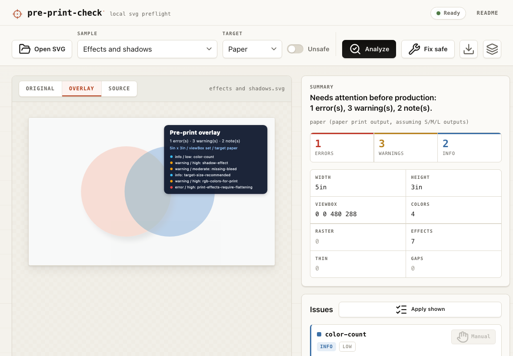

# pre-print-check


`pre-print-check` is a local SVG preflight and repair tool for artwork headed to paper, packaging, fabric, vinyl, signage, banners, vehicle wraps, laser engraving, CNC, plotters, and web output.

It catches production risks that are visible in SVG source, gives them stable issue codes, and applies only conservative automatic fixes by default. It does not replace a printer proof, RIP, cutter setup, or press-ready PDF workflow. It gives you the earlier, cheaper warning.

<p>
  
</p>

## Highlights

- **Default check command:** run `pre-print-check art.svg`; the explicit `check` subcommand still works.
- **Material-aware targets:** paper, packaging, fabric, vinyl, banners, signage, vehicle wraps, laser, CNC, plotters, screen, and physical sizes.
- **Stable issue codes:** scriptable findings such as `missing-viewbox`, `raster-not-cuttable`, `thin-stroke`, and `missing-bleed`.
- **Visual overlays:** generate an annotated SVG overlay for locatable production risks.
- **Safe fixes first:** metadata and simple bleed repairs by default; destructive changes require `--unsafe`.
- **Local JS runtime:** the npm package wraps the Go engine compiled to WASM; SVG input stays in the process/browser.

## Why It Exists

SVGs move easily between design tools, web apps, storefronts, and print shops, but production workflows are not all looking for the same thing:

- A sticker cutter wants clean vector geometry, not hidden raster art.
- A paper or packaging job cares about bleed, safe area, flattening, RGB assumptions, and handoff risk.
- A banner or wrap may turn a tiny low-resolution image into a very visible problem.
- A browser can tolerate external references and scripts that a production workflow should reject.

`pre-print-check` gives those concerns names, severities, ranks, and stable issue codes so people and scripts can act on them.

## Install

Build the native CLI from this repository:

```sh
make build
./pre-print-check --target vinyl art.svg
```

Install the CLI with Go:

```sh
go install github.com/justsml/pre-print-check@latest
```

Use the Go package in another project:

```sh
go get github.com/justsml/pre-print-check/svgcheck
```

Or use the WASM package from JavaScript:

```sh
npm install pre-print-check
npx pre-print-check --target vinyl art.svg
```

```js
import { promises as fs } from "node:fs";
import { check, fix } from "pre-print-check";

const svg = await fs.readFile("art.svg", "utf8");
const report = await check(svg, { target: "packaging" });

if (report.counts.errors > 0) {
  console.log(report.friendlySummary);
  console.table(report.issues.map(({ severity, code, message }) => ({ severity, code, message })));
}

const repaired = await fix(svg, {
  categories: ["metadata", "bleed"],
  target: "paper",
});
```

The npm package is a wrapper around the same Go engine compiled to WebAssembly. It runs locally in Node or the browser and does not upload SVG input.

## Go API

The public Go package is available at `github.com/justsml/pre-print-check/svgcheck`:

```go
package main

import (
	"fmt"
	"os"

	"github.com/justsml/pre-print-check/svgcheck"
)

func main() {
	input, err := os.ReadFile("art.svg")
	if err != nil {
		panic(err)
	}

	report, err := svgcheck.Check(input, "vinyl")
	if err != nil {
		panic(err)
	}

	for _, issue := range report.Issues {
		fmt.Printf("[%s] %s: %s\n", issue.Severity, issue.Code, issue.Message)
	}
}
```

The package exposes the same core engine used by the CLI and WASM package:

- `svgcheck.Check` and `svgcheck.CheckFile` for reports.
- `svgcheck.GenerateOverlay` for visual issue overlays.
- `svgcheck.Fix` for conservative SVG repairs.
- `svgcheck.ParseTarget`, target constants, issue severities, ranks, and fix categories.

To publish a new Go package version, bump the NPM version, tag the module with a semantic version, and push the tag:

```sh
npm version minor
git tag v0.3.0
git push origin v0.3.0
GOPROXY=proxy.golang.org go list -m github.com/justsml/pre-print-check@v0.3.0
```

Tagged `v*` releases are published automatically by GitHub Actions on the `main` branch path.

## Quick Start

Check one SVG:

```sh
./pre-print-check --target paper art.svg
```

Write a Markdown or HTML report:

```sh
./pre-print-check --target vinyl --format md art.svg > report.md
./pre-print-check --target banner@20ft --format html art.svg > report.html
```

Generate a visual overlay for locatable production risks:

```sh
./pre-print-check --target paper --overlay art.overlay.svg art.svg
```

Apply safe automatic fixes to a copy:

```sh
./pre-print-check fix --target paper -o art.fixed.svg art.svg
```

Apply selected fixes:

```sh
./pre-print-check fix --fix metadata,bleed -o art.fixed.svg art.svg
```

Allow destructive repairs only when you mean it:

```sh
./pre-print-check fix --fix safety,effects,raster --unsafe -o stripped.svg art.svg
```

## Targets

Targets can describe an output material, a physical size, a resolution, or a material plus size.

```sh
./pre-print-check --target screen art.svg
./pre-print-check --target paper art.svg
./pre-print-check --target vinyl art.svg
./pre-print-check --target fabric@14in art.svg
./pre-print-check --target banner@20ft art.svg
./pre-print-check --target 90in art.svg
./pre-print-check --target 1.2m art.svg
./pre-print-check --target 4k art.svg
./pre-print-check --target 8k art.svg
```

Supported material intents:

| Target | Aliases | Typical extra scrutiny |
| --- | --- | --- |
| `screen` | `web`, `digital`, `display` | unsafe content, references, basic SVG metadata |
| `paper` | `print`, `poster`, `flyer`, `card` | RGB assumptions, bleed/safe area, effects, raster resolution |
| `fabric` | `textile`, `apparel`, `shirt`, `dtg` | color count, small details, effects, raster content |
| `vinyl` | `sticker`, `decal`, `cut-vinyl` | pure vector geometry, text, effects, raster content |
| `banner` | `mesh-banner` | large-format raster/effect risks and scale-sensitive details |
| `signage` | `sign`, `signs` | large-format output risks and safe-area review |
| `vehicle-wrap` | `wrap`, `car-wrap`, `truck-wrap` | large physical scale, bleed/safe area, flattening risk |
| `packaging` | `package`, `label` | print color assumptions, effects, safe area, handoff risk |
| `laser` | `engraving`, `laser-cut` | vector-only geometry and cutter-style constraints |
| `cnc` | `router`, `mill` | vector-only geometry and path health |
| `plotter` | `vinyl-cutter`, `cut-plotter` | vector-only geometry and cuttable paths |

## What It Checks

`pre-print-check` reports objective blockers when it can prove a problem from the SVG:

- missing `viewBox`, missing SVG namespace, and missing explicit size
- scripts and inline event handlers
- external references that may fail offline or during production handoff
- raster images, including inline base64 raster images
- filters, masks, clipping, opacity, blend modes, and shadow-like effects
- target-specific failures, such as raster art in cutter or engraver output

It also reports ranked review findings where human judgment still matters:

- approximate color count and production complexity
- thin strokes and tiny details at material scale
- near-disconnected stroked endpoints that may look joined but cut or print poorly
- background transparency, missing bleed, and safe-area risk
- rough effective-resolution concerns for size-based targets

Issue codes are lowercase and stable, such as `missing-viewbox`, `raster-not-cuttable`, `thin-stroke`, and `missing-bleed`. They are meant to be useful in CI, storefront upload checks, and design handoff tooling.

## Fixes

By default, `fix` only performs conservative changes:

| Category | Default behavior |
| --- | --- |
| `metadata` | add missing SVG namespace, derive `viewBox` from numeric size, derive missing `width` or `height` from `viewBox` |
| `bleed` | expand simple full-background rectangles when target geometry makes the missing bleed clear |
| `safety` | skipped unless `--unsafe` is provided |
| `effects` | skipped unless `--unsafe` is provided |
| `raster` | skipped unless `--unsafe` is provided |
| `references`, `colors`, `strokes`, `geometry`, `typography`, `detail`, `sizing`, `cutter` | advisory today because they usually need source assets, fonts, profiles, product templates, or design judgment |

`--unsafe` allows selected destructive transformations, including removing scripts, inline event handlers, raster image elements, and effect/transparency constructs. Those changes can alter artwork, so the flag is explicit on purpose.

## JavaScript API

The default npm entrypoint exposes the full local WASM runtime:

```js
import { loadPrePrintCheck, check, overlay, fix, fixCategories } from "pre-print-check";

const report = await check(svg, { target: "vinyl" });
const overlaySVG = await overlay(svg, { target: "vinyl" });
const fixed = await fix(svg, {
  target: "paper",
  categories: ["metadata", "bleed"],
});
const categories = await fixCategories();

const prePrint = await loadPrePrintCheck();
const sameReport = prePrint.check(svg, { target: "paper" });
```

Limited-scope entrypoints are available when an app only needs one surface:

```js
import { check } from "pre-print-check/check";
import { fix, fixCategories } from "pre-print-check/fix";
```

The root entrypoint loads `dist/pre-print-check.wasm`, `/check` loads `dist/pre-print-check-check.wasm`, and `/fix` loads `dist/pre-print-check-fix.wasm`.

`check()` returns a structured report:

```ts
type PrePrintCheckReport = {
  summary: string;
  friendlySummary: string;
  target?: string;
  targetDetails?: string;
  counts: { errors: number; warnings: number; info: number };
  meta: Record<string, string | number | undefined>;
  issues: Array<{
    severity: "error" | "warning" | "info" | string;
    code: string;
    message: string;
    rank?: "low" | "moderate" | "high" | string;
    fixCategory?: string;
    unsafeRequired?: boolean;
    automaticFix: boolean;
  }>;
  fixCategories: string[];
};
```

`fix()` returns the repaired SVG plus fix notes:

```ts
type FixResult = {
  svg: string;
  changes: string[];
  skipped: string[];
};
```

The loaders read their matching WASM binary plus `dist/wasm_exec.js` from the installed package. Browser bundlers that need explicit asset URLs can pass them:

```js
const prePrint = await loadPrePrintCheck({
  wasmURL: new URL("./pre-print-check.wasm", import.meta.url),
  wasmExecURL: new URL("./wasm_exec.js", import.meta.url),
});
```

CommonJS works too:

```js
const { check } = require("pre-print-check");
const report = await check(svg, { target: "paper" });
```

## Browser Demo

Build the WASM runtime and serve the local demo:

```sh
make serve-web
```

Then open `http://127.0.0.1:8765/docs/`.

The demo loads SVGs locally, shows the original/overlay/source views, applies safe fixes, and can download the repaired SVG or issue overlay.

You can preload the playground with a bundled sample for screenshots or demos:

```txt
http://127.0.0.1:8765/docs/?sample=Effects%20and%20shadows&target=paper&view=overlay
```

## Development

```sh
make build      # native CLI
make test       # go test ./...
make vet        # go vet ./...
make wasm       # full, check-only, and fix-only WASM binaries plus Go wasm_exec.js
npm test        # build WASM and run the JS wrapper smoke test
```

Project layout:

- `main.go` boots the native command.
- `internal/cli/` owns command parsing, user-facing output, exit codes, and file I/O.
- `internal/svgcheck/` owns SVG inspection, target parsing, issues, overlays, and fixes.
- `cmd/preprintcheck-wasm/` exposes the checker to JavaScript through Go WASM.
- `npm/` wraps the WASM runtime as the `pre-print-check` npm package.
- `docs/` contains the local browser demo.

Run `make test` before opening a PR. Run `make vet` when changing parsing, file handling, or reporting.

## Limits

SVG is a flexible interchange format, not a full production ticket. Some facts cannot be proven from an SVG alone:

- final CMYK, spot-color, ICC, overprint, knockout, white-ink, or underbase behavior
- printer-specific bleed, trim, fold, gutter, imposition, and safe-zone templates
- font licensing or font availability outside the SVG
- RIP-specific handling of transparency, filters, masks, clipping, shadows, and blend modes
- true output quality for unresolved external resources

For press output, use `pre-print-check` before exporting or reviewing the final press-ready PDF. Then confirm the printer's product template, bleed, trim, safe zone, color, font, image-resolution, flattening, and proofing requirements.

## Roadmap

See [docs/preflight-roadmap.md](docs/preflight-roadmap.md) for planned production-preflight gaps, implementation handoffs, and suggested agent assignments.
